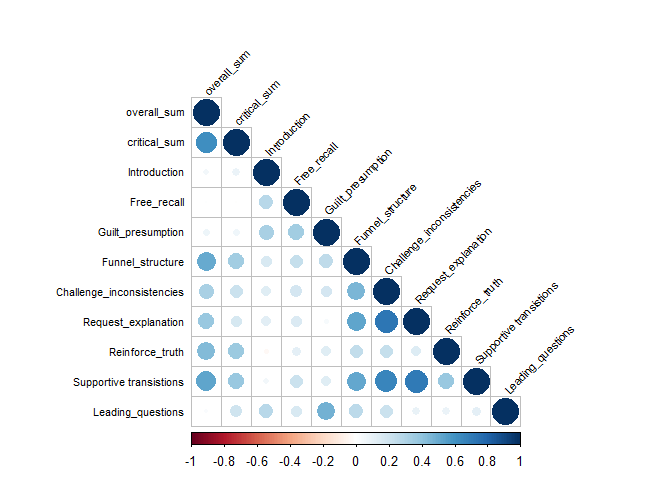
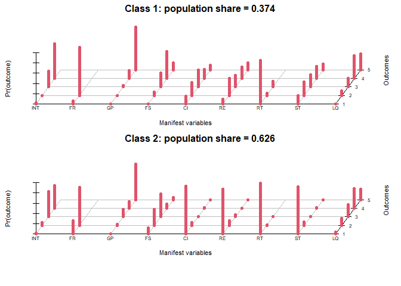
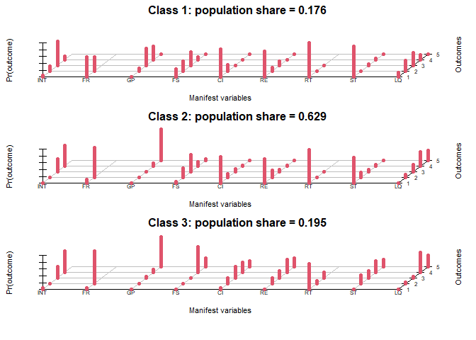
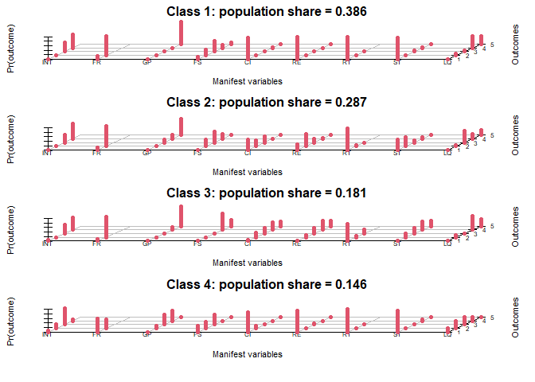
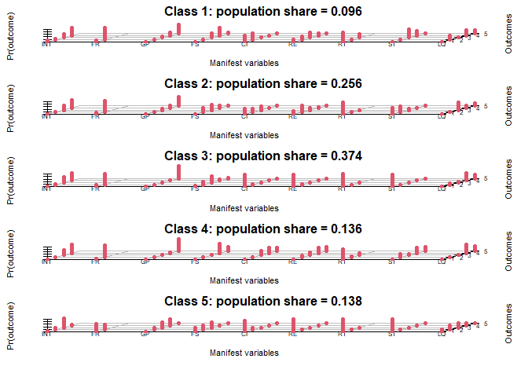

SoS Training - Main report
================
2025-07-15

- [Demographics](#demographics)
  - [Interviewers](#interviewers)
    - [Age](#age)
    - [Gender](#gender)
  - [Interviewees](#interviewees)
    - [Age](#age-1)
    - [Gender](#gender-1)
- [Coding agreement, Information
  Disclosure](#coding-agreement-information-disclosure)
  - [Intraclass correlation
    coefficient](#intraclass-correlation-coefficient)
  - [95% Confidnce Interval](#95-confidnce-interval)
- [Preliminary Analyses](#preliminary-analyses)
  - [Suspect Motivation](#suspect-motivation)
    - [Descriptives](#descriptives)
    - [Pairwise comparison, training](#pairwise-comparison-training)
  - [Engagement](#engagement)
    - [Pairwise comparison, training](#pairwise-comparison-training-1)
  - [Confidence](#confidence)
    - [Pairwise comparison, training](#pairwise-comparison-training-2)
- [Hypothesis Testing, Information
  Disclosure](#hypothesis-testing-information-disclosure)
  - [Main effect model](#main-effect-model)
  - [Interaction effect model](#interaction-effect-model)
  - [Model comparison](#model-comparison)
- [Interviewer tactics](#interviewer-tactics)
  - [Correlation table, Interviewer tactics and information
    disclosure](#correlation-table-interviewer-tactics-and-information-disclosure)
    - [Correlogram, Interviewer tactics and information
      disclosure](#correlogram-interviewer-tactics-and-information-disclosure)
  - [Models predicting information
    disclosure](#models-predicting-information-disclosure)
    - [Overall infromation](#overall-infromation)
    - [Critical information](#critical-information)
- [Exloring classes of interviews](#exloring-classes-of-interviews)
  - [Model comparison for latent class analyses with 2,3,4 & 5
    classes](#model-comparison-for-latent-class-analyses-with-234--5-classes)
  - [Plots with estimated class-conditional response probabilities and
    estimated population proportion in each
    class.](#plots-with-estimated-class-conditional-response-probabilities-and-estimated-population-proportion-in-each-class)
    - [2-class solution](#2-class-solution)
    - [3-class solution](#3-class-solution)
    - [4-class solution](#4-class-solution)
    - [5-class solution](#5-class-solution)
  - [Predicted class-membership for 4-class solution, split by
    training](#predicted-class-membership-for-4-class-solution-split-by-training)
- [Post-interview questionnaire](#post-interview-questionnaire)
  - [Suspects’ assessment of
    performance](#suspects-assessment-of-performance)
  - [Interviewer Knowledge](#interviewer-knowledge)
  - [Change strategy](#change-strategy)
    - [Suspects’ self-report of changing strategy, split by predicted
      class-membership (4-class
      solution)](#suspects-self-report-of-changing-strategy-split-by-predicted-class-membership-4-class-solution)

# Demographics

## Interviewers

### Age

| Age_M | Age_SD | Age_Mdn | Age_Min | Age_Max |
|------:|-------:|--------:|--------:|--------:|
| 27.23 |   9.07 |      24 |      19 |      55 |

### Gender

| interviewer_gender        |   n | rel_freq |
|:--------------------------|----:|:---------|
| Female                    |  20 | 65%      |
| Male                      |  10 | 32%      |
| Non-binary / Third gender |   1 | 3%       |

## Interviewees

### Age

| Age_M | Age_SD | Age_Mdn | Age_min | Age_max |
|------:|-------:|--------:|--------:|--------:|
| 32.78 |  10.93 |      30 |      18 |      70 |

### Gender

| gender |   n | rel_freq |
|-------:|----:|:---------|
|      1 |  66 | 53%      |
|      2 |  47 | 38%      |
|      3 |   2 | 2%       |
|     NA |   9 | 7%       |

# Coding agreement, Information Disclosure

## Intraclass correlation coefficient

    ## [1] 0.8072333

## 95% Confidnce Interval

    ## BOOTSTRAP CONFIDENCE INTERVAL CALCULATIONS
    ## Based on 750 bootstrap replicates
    ## 
    ## CALL : 
    ## boot.ci(boot.out = disclosure_boot_icc, type = "perc", index = 1)
    ## 
    ## Intervals : 
    ## Level     Percentile     
    ## 95%   ( 0.7588,  0.8500 )  
    ## Calculations and Intervals on Original Scale

# Preliminary Analyses

## Suspect Motivation

### Descriptives

| sos_training | Mean |   SD | Median |   SE | Upper | Lower |
|:-------------|-----:|-----:|-------:|-----:|------:|------:|
| Basic        | 5.85 | 1.35 |      6 | 0.16 |  6.17 |  5.53 |
| SoS          | 6.00 | 1.20 |      6 | 0.15 |  6.30 |  5.70 |

### Pairwise comparison, training

    ## 
    ##  Welch Two Sample t-test
    ## 
    ## data:  motivation by sos_training
    ## t = -0.65579, df = 123.98, p-value = 0.5132
    ## alternative hypothesis: true difference in means between group Basic and group SoS is not equal to 0
    ## 95 percent confidence interval:
    ##  -0.5997259  0.3012184
    ## sample estimates:
    ## mean in group Basic   mean in group SoS 
    ##            5.850746            6.000000

## Engagement

| sos_training | Mean |   SD | Median |   SE | Upper | Lower |
|:-------------|-----:|-----:|-------:|-----:|------:|------:|
| Basic        | 6.27 | 1.07 |      7 | 0.13 |  6.52 |  6.01 |
| SoS          | 6.38 | 1.12 |      7 | 0.14 |  6.66 |  6.10 |

### Pairwise comparison, training

    ## 
    ##  Welch Two Sample t-test
    ## 
    ## data:  engagement by sos_training
    ## t = -0.57092, df = 117.58, p-value = 0.5691
    ## alternative hypothesis: true difference in means between group Basic and group SoS is not equal to 0
    ## 95 percent confidence interval:
    ##  -0.5080255  0.2806548
    ## sample estimates:
    ## mean in group Basic   mean in group SoS 
    ##            6.265625            6.379310

## Confidence

| sos_training | Mean |   SD | Median |   SE | Upper | Lower |
|:-------------|-----:|-----:|-------:|-----:|------:|------:|
| Basic        | 4.54 | 1.72 |      5 | 0.21 |  4.94 |  4.13 |
| SoS          | 4.63 | 1.86 |      5 | 0.24 |  5.09 |  4.17 |

### Pairwise comparison, training

    ## 
    ##  Welch Two Sample t-test
    ## 
    ## data:  confidence by sos_training
    ## t = -0.28063, df = 118.99, p-value = 0.7795
    ## alternative hypothesis: true difference in means between group Basic and group SoS is not equal to 0
    ## 95 percent confidence interval:
    ##  -0.7234563  0.5438459
    ## sample estimates:
    ## mean in group Basic   mean in group SoS 
    ##            4.537313            4.627119

# Hypothesis Testing, Information Disclosure

## Main effect model

    ## Linear mixed model fit by maximum likelihood . t-tests use Satterthwaite's
    ##   method [lmerModLmerTest]
    ## Formula: detail ~ sos_training + critical + interview + (1 | id) + (1 |  
    ##     mc_sequence:interviewee) + (1 | mc_sequence)
    ##    Data: my_df
    ## 
    ##      AIC      BIC   logLik deviance df.resid 
    ##   2380.6   2417.6  -1182.3   2364.6      742 
    ## 
    ## Scaled residuals: 
    ##     Min      1Q  Median      3Q     Max 
    ## -2.2900 -0.6801 -0.1238  0.3962  3.4320 
    ## 
    ## Random effects:
    ##  Groups                  Name        Variance Std.Dev.
    ##  mc_sequence:interviewee (Intercept) 0.4402   0.6635  
    ##  id                      (Intercept) 0.0000   0.0000  
    ##  mc_sequence             (Intercept) 0.0000   0.0000  
    ##  Residual                            1.1196   1.0581  
    ## Number of obs: 750, groups:  
    ## mc_sequence:interviewee, 125; id, 31; mc_sequence, 29
    ## 
    ## Fixed effects:
    ##               Estimate Std. Error        df t value Pr(>|t|)    
    ## (Intercept)    0.91922    0.12872 137.01181   7.142 4.93e-11 ***
    ## sos_training   0.39724    0.14596 124.99988   2.722  0.00743 ** 
    ## critical      -0.81200    0.08196 625.00007  -9.907  < 2e-16 ***
    ## interview      0.14343    0.06035 124.99988   2.377  0.01899 *  
    ## ---
    ## Signif. codes:  0 '***' 0.001 '**' 0.01 '*' 0.05 '.' 0.1 ' ' 1
    ## 
    ## Correlation of Fixed Effects:
    ##             (Intr) ss_trn critcl
    ## sos_trainng -0.386              
    ## critical    -0.212  0.000       
    ## interview   -0.595 -0.242  0.000
    ## optimizer (nloptwrap) convergence code: 0 (OK)
    ## boundary (singular) fit: see help('isSingular')

## Interaction effect model

    ## Linear mixed model fit by maximum likelihood . t-tests use Satterthwaite's
    ##   method [lmerModLmerTest]
    ## Formula: detail ~ sos_training + critical + interview + sos_training *  
    ##     critical + sos_training * interview + (1 | id) + (1 | mc_sequence:interviewee) +  
    ##     (1 | mc_sequence)
    ##    Data: my_df
    ## 
    ##      AIC      BIC   logLik deviance df.resid 
    ##   2373.6   2419.8  -1176.8   2353.6      740 
    ## 
    ## Scaled residuals: 
    ##     Min      1Q  Median      3Q     Max 
    ## -2.4030 -0.6628 -0.1008  0.3810  3.5481 
    ## 
    ## Random effects:
    ##  Groups                  Name        Variance Std.Dev.
    ##  mc_sequence:interviewee (Intercept) 0.4433   0.6658  
    ##  id                      (Intercept) 0.0000   0.0000  
    ##  mc_sequence             (Intercept) 0.0000   0.0000  
    ##  Residual                            1.1001   1.0489  
    ## Number of obs: 750, groups:  
    ## mc_sequence:interviewee, 125; id, 31; mc_sequence, 29
    ## 
    ## Fixed effects:
    ##                         Estimate Std. Error        df t value Pr(>|t|)    
    ## (Intercept)              0.83982    0.14584 143.88242   5.759 4.94e-08 ***
    ## sos_training             0.54596    0.25256 137.28134   2.162 0.032378 *  
    ## critical                -0.54365    0.11444 624.99907  -4.750 2.52e-06 ***
    ## interview                0.13551    0.07822 125.00170   1.732 0.085668 .  
    ## sos_training:critical   -0.54103    0.16250 624.99907  -3.329 0.000921 ***
    ## sos_training:interview   0.01954    0.12292 125.00170   0.159 0.873936    
    ## ---
    ## Signif. codes:  0 '***' 0.001 '**' 0.01 '*' 0.05 '.' 0.1 ' ' 1
    ## 
    ## Correlation of Fixed Effects:
    ##             (Intr) ss_trn critcl intrvw ss_trnng:c
    ## sos_trainng -0.577                                
    ## critical    -0.262  0.151                         
    ## interview   -0.681  0.393  0.000                  
    ## ss_trnng:cr  0.184 -0.214 -0.704  0.000           
    ## ss_trnng:nt  0.433 -0.787  0.000 -0.636  0.000    
    ## optimizer (nloptwrap) convergence code: 0 (OK)
    ## boundary (singular) fit: see help('isSingular')

## Model comparison

    ## Data: my_df
    ## Models:
    ## simple_model: detail ~ sos_training + critical + interview + (1 | id) + (1 | mc_sequence:interviewee) + (1 | mc_sequence)
    ## interaction_model: detail ~ sos_training + critical + interview + sos_training * critical + sos_training * interview + (1 | id) + (1 | mc_sequence:interviewee) + (1 | mc_sequence)
    ##                   npar    AIC    BIC  logLik deviance  Chisq Df Pr(>Chisq)   
    ## simple_model         8 2380.6 2417.6 -1182.3   2364.6                        
    ## interaction_model   10 2373.6 2419.8 -1176.8   2353.6 11.014  2   0.004059 **
    ## ---
    ## Signif. codes:  0 '***' 0.001 '**' 0.01 '*' 0.05 '.' 0.1 ' ' 1

# Interviewer tactics

## Correlation table, Interviewer tactics and information disclosure

|                           | overall_sum | critical_sum | Introduction | Free_recall | Guilt_presumption | Funnel_structure | Challenge_inconsistencies | Request_explanation | Reinforce_truth | Supportive transistions | Leading_questions |
|:--------------------------|------------:|-------------:|-------------:|------------:|------------------:|-----------------:|--------------------------:|--------------------:|----------------:|------------------------:|------------------:|
| overall_sum               |        1.00 |         0.61 |         0.06 |        0.01 |              0.08 |             0.51 |                      0.32 |                0.37 |            0.43 |                    0.53 |              0.03 |
| critical_sum              |        0.61 |         1.00 |         0.09 |        0.00 |              0.06 |             0.34 |                      0.22 |                0.17 |            0.37 |                    0.37 |              0.21 |
| Introduction              |        0.06 |         0.09 |         1.00 |        0.27 |              0.32 |             0.16 |                      0.14 |                0.13 |           -0.03 |                    0.05 |              0.28 |
| Free_recall               |        0.01 |         0.00 |         0.27 |        1.00 |              0.34 |             0.23 |                      0.19 |                0.15 |            0.12 |                    0.22 |              0.16 |
| Guilt_presumption         |        0.08 |         0.06 |         0.32 |        0.34 |              1.00 |             0.25 |                      0.18 |                0.03 |            0.13 |                    0.14 |              0.47 |
| Funnel_structure          |        0.51 |         0.34 |         0.16 |        0.23 |              0.25 |             1.00 |                      0.46 |                0.52 |            0.24 |                    0.52 |              0.26 |
| Challenge_inconsistencies |        0.32 |         0.22 |         0.14 |        0.19 |              0.18 |             0.46 |                      1.00 |                0.72 |            0.23 |                    0.65 |              0.22 |
| Request_explanation       |        0.37 |         0.17 |         0.13 |        0.15 |              0.03 |             0.52 |                      0.72 |                1.00 |            0.15 |                    0.70 |              0.10 |
| Reinforce_truth           |        0.43 |         0.37 |        -0.03 |        0.12 |              0.13 |             0.24 |                      0.23 |                0.15 |            1.00 |                    0.37 |              0.09 |
| Supportive transistions   |        0.53 |         0.37 |         0.05 |        0.22 |              0.14 |             0.52 |                      0.65 |                0.70 |            0.37 |                    1.00 |              0.12 |
| Leading_questions         |        0.03 |         0.21 |         0.28 |        0.16 |              0.47 |             0.26 |                      0.22 |                0.10 |            0.09 |                    0.12 |              1.00 |

### Correlogram, Interviewer tactics and information disclosure

<!-- -->

## Models predicting information disclosure

### Overall infromation

    ## Linear mixed model fit by maximum likelihood . t-tests use Satterthwaite's
    ##   method [lmerModLmerTest]
    ## Formula: overall_sum ~ Introduction + Free_recall + Guilt_presumption +  
    ##     Funnel_structure + Challenge_inconsistencies + Request_explanation +  
    ##     Reinforce_truth + `Supportive transistions` + Leading_questions +  
    ##     (1 | ID) + (1 | MC)
    ##    Data: detail_merged
    ## 
    ##      AIC      BIC   logLik deviance df.resid 
    ##    684.8    721.1   -329.4    658.8      108 
    ## 
    ## Scaled residuals: 
    ##     Min      1Q  Median      3Q     Max 
    ## -2.6893 -0.6759 -0.2148  0.6705  2.5072 
    ## 
    ## Random effects:
    ##  Groups   Name        Variance Std.Dev.
    ##  ID       (Intercept)  0.000   0.000   
    ##  MC       (Intercept)  1.011   1.005   
    ##  Residual             12.931   3.596   
    ## Number of obs: 121, groups:  ID, 31; MC, 6
    ## 
    ## Fixed effects:
    ##                           Estimate Std. Error       df t value Pr(>|t|)    
    ## (Intercept)                 2.8759     2.1890 120.6446   1.314 0.191417    
    ## Introduction                0.6510     0.5657 117.2374   1.151 0.252140    
    ## Free_recall                -2.0538     0.9441 117.2030  -2.175 0.031605 *  
    ## Guilt_presumption          -0.1705     0.5617 118.7585  -0.304 0.761930    
    ## Funnel_structure            1.6399     0.4156 119.8594   3.946 0.000134 ***
    ## Challenge_inconsistencies  -0.2503     0.4582 116.3195  -0.546 0.585868    
    ## Request_explanation        -0.1443     0.4894 120.9577  -0.295 0.768693    
    ## Reinforce_truth             2.8805     0.8753 120.1776   3.291 0.001310 ** 
    ## `Supportive transistions`   1.6081     0.4416 118.2017   3.641 0.000404 ***
    ## Leading_questions          -0.4053     0.3866 119.0935  -1.048 0.296549    
    ## ---
    ## Signif. codes:  0 '***' 0.001 '**' 0.01 '*' 0.05 '.' 0.1 ' ' 1
    ## 
    ## Correlation of Fixed Effects:
    ##             (Intr) Intrdc Fr_rcl Glt_pr Fnnl_s Chlln_ Rqst_x Rnfrc_ `Strn`
    ## Introductin -0.574                                                        
    ## Free_recall  0.045 -0.173                                                 
    ## Glt_prsmptn -0.457 -0.193 -0.235                                          
    ## Fnnl_strctr -0.098 -0.016 -0.064 -0.122                                   
    ## Chllng_ncns  0.147  0.010  0.003 -0.104 -0.007                            
    ## Rqst_xplntn -0.062 -0.135 -0.002  0.208 -0.266 -0.497                     
    ## Renfrc_trth  0.008  0.057 -0.050 -0.033 -0.093 -0.077  0.198              
    ## `Strnsstns` -0.005  0.108 -0.088 -0.073 -0.159 -0.214 -0.410 -0.309       
    ## Ledng_qstns  0.013 -0.142  0.037 -0.368 -0.120 -0.161  0.075  0.004  0.069
    ## optimizer (nloptwrap) convergence code: 0 (OK)
    ## boundary (singular) fit: see help('isSingular')

### Critical information

    ## Linear mixed model fit by maximum likelihood . t-tests use Satterthwaite's
    ##   method [lmerModLmerTest]
    ## Formula: critical_sum ~ Introduction + Free_recall + Guilt_presumption +  
    ##     Funnel_structure + Challenge_inconsistencies + Request_explanation +  
    ##     Reinforce_truth + `Supportive transistions` + Leading_questions +  
    ##     (1 | ID) + (1 | MC)
    ##    Data: detail_merged
    ## 
    ##      AIC      BIC   logLik deviance df.resid 
    ##    393.4    429.7   -183.7    367.4      108 
    ## 
    ## Scaled residuals: 
    ##     Min      1Q  Median      3Q     Max 
    ## -1.8146 -0.6873 -0.1030  0.4892  4.3567 
    ## 
    ## Random effects:
    ##  Groups   Name        Variance  Std.Dev. 
    ##  ID       (Intercept) 1.977e-02 1.406e-01
    ##  MC       (Intercept) 1.040e-09 3.225e-05
    ##  Residual             1.200e+00 1.095e+00
    ## Number of obs: 121, groups:  ID, 31; MC, 6
    ## 
    ## Fixed effects:
    ##                            Estimate Std. Error        df t value Pr(>|t|)   
    ## (Intercept)                 0.20817    0.66361  87.92137   0.314  0.75449   
    ## Introduction                0.20353    0.17307 108.60142   1.176  0.24216   
    ## Free_recall                -0.45818    0.28934 101.61372  -1.584  0.11640   
    ## Guilt_presumption          -0.23226    0.17016 119.29346  -1.365  0.17483   
    ## Funnel_structure            0.29985    0.12579  91.66502   2.384  0.01920 * 
    ## Challenge_inconsistencies  -0.01008    0.14055 111.47611  -0.072  0.94296   
    ## Request_explanation        -0.24796    0.14565 113.05599  -1.702  0.09142 . 
    ## Reinforce_truth             0.73046    0.26326 119.56841   2.775  0.00641 **
    ## `Supportive transistions`   0.38411    0.13405 120.48962   2.865  0.00492 **
    ## Leading_questions           0.20651    0.11794  72.65978   1.751  0.08416 . 
    ## ---
    ## Signif. codes:  0 '***' 0.001 '**' 0.01 '*' 0.05 '.' 0.1 ' ' 1
    ## 
    ## Correlation of Fixed Effects:
    ##             (Intr) Intrdc Fr_rcl Glt_pr Fnnl_s Chlln_ Rqst_x Rnfrc_ `Strn`
    ## Introductin -0.585                                                        
    ## Free_recall  0.038 -0.179                                                 
    ## Glt_prsmptn -0.468 -0.182 -0.232                                          
    ## Fnnl_strctr -0.098 -0.031 -0.065 -0.120                                   
    ## Chllng_ncns  0.147  0.005 -0.004 -0.099 -0.015                            
    ## Rqst_xplntn -0.072 -0.110  0.013  0.188 -0.243 -0.494                     
    ## Renfrc_trth  0.003  0.077 -0.026 -0.041 -0.098 -0.066  0.179              
    ## `Strnsstns` -0.003  0.093 -0.100 -0.051 -0.157 -0.223 -0.407 -0.304       
    ## Ledng_qstns  0.004 -0.146  0.045 -0.360 -0.102 -0.159  0.069 -0.008  0.053
    ## optimizer (nloptwrap) convergence code: 0 (OK)
    ## boundary (singular) fit: see help('isSingular')

# Exloring classes of interviews

## Model comparison for latent class analyses with 2,3,4 & 5 classes

| Classes |      AIC |      BIC | LogLikelihood |   Entropy |
|--------:|---------:|---------:|--------------:|----------:|
|       2 | 2046.892 | 2217.937 |     -962.4460 | 0.9318218 |
|       3 | 2034.826 | 2292.796 |     -925.4130 | 0.9683205 |
|       4 | 2023.057 | 2367.952 |     -888.5286 | 0.9370148 |
|       5 | 2042.510 | 2474.330 |     -867.2552 | 0.9492861 |

## Plots with estimated class-conditional response probabilities and estimated population proportion in each class.

INT = Introduction FR = Free Recall GP = Guilt presumption (Higher
scores indicate less use) FS = Funnel Structure CI = Challenging
Inconsistencies RE = Request Explanation RT = Reinforce Truth ST =
Supportive Transistions LQ = Leading Questions (Higher scores indicate
less use)

### 2-class solution

### 3-class solution

### 4-class solution

### 5-class solution

## Predicted class-membership for 4-class solution, split by training

Class by columns, Training by rows.

0 = Basic training 1 = SoS training

|     |   1 |   2 |   3 |   4 |
|:----|----:|----:|----:|----:|
| 0   |  42 |   8 |   1 |   9 |
| 1   |   6 |  26 |  21 |   9 |

# Post-interview questionnaire

## Suspects’ assessment of performance

    ## # A tibble: 2 × 4
    ##   sos_training  Mean    SD Median
    ##   <fct>        <dbl> <dbl>  <dbl>
    ## 1 Basic         3.07  1.09    3  
    ## 2 SoS           2.62  1.04    2.5

    ## Linear mixed model fit by maximum likelihood . t-tests use Satterthwaite's
    ##   method [lmerModLmerTest]
    ## Formula: self_assessment ~ sos_training + interview + (1 | id) + (1 |      mc)
    ##    Data: interviewee_df
    ## 
    ##      AIC      BIC   logLik deviance df.resid 
    ##    364.8    381.7   -176.4    352.8      116 
    ## 
    ## Scaled residuals: 
    ##      Min       1Q   Median       3Q      Max 
    ## -1.92506 -0.71360  0.00954  0.64424  2.25686 
    ## 
    ## Random effects:
    ##  Groups   Name        Variance Std.Dev.
    ##  id       (Intercept) 0.2110   0.4594  
    ##  mc       (Intercept) 0.0000   0.0000  
    ##  Residual             0.8945   0.9458  
    ## Number of obs: 122, groups:  id, 31; mc, 6
    ## 
    ## Fixed effects:
    ##                  Estimate Std. Error        df t value Pr(>|t|)    
    ## (Intercept)       2.87883    0.22280 118.65848  12.921   <2e-16 ***
    ## sos_trainingSoS  -0.43745    0.21603  74.15681  -2.025   0.0465 *  
    ## interview         0.06951    0.06834 113.55116   1.017   0.3112    
    ## ---
    ## Signif. codes:  0 '***' 0.001 '**' 0.01 '*' 0.05 '.' 0.1 ' ' 1
    ## 
    ## Correlation of Fixed Effects:
    ##             (Intr) ss_tSS
    ## sos_trnngSS -0.305       
    ## interview   -0.706 -0.208
    ## optimizer (nloptwrap) convergence code: 0 (OK)
    ## boundary (singular) fit: see help('isSingular')

## Interviewer Knowledge

    ## # A tibble: 2 × 4
    ##   sos_training  Mean    SD Median
    ##   <fct>        <dbl> <dbl>  <dbl>
    ## 1 Basic         3.36  1.93      3
    ## 2 SoS           5.34  1.64      6

    ## Linear mixed model fit by maximum likelihood . t-tests use Satterthwaite's
    ##   method [lmerModLmerTest]
    ## Formula: knowledge_before ~ sos_training + interview + (1 | id) + (1 |      mc)
    ##    Data: interviewee_df
    ## 
    ##      AIC      BIC   logLik deviance df.resid 
    ##    496.7    513.5   -242.3    484.7      116 
    ## 
    ## Scaled residuals: 
    ##     Min      1Q  Median      3Q     Max 
    ## -2.5151 -0.6045  0.1482  0.7357  2.0656 
    ## 
    ## Random effects:
    ##  Groups   Name        Variance Std.Dev.
    ##  id       (Intercept) 0.3697   0.608   
    ##  mc       (Intercept) 0.0000   0.000   
    ##  Residual             2.7986   1.673   
    ## Number of obs: 122, groups:  id, 31; mc, 6
    ## 
    ## Fixed effects:
    ##                  Estimate Std. Error        df t value Pr(>|t|)    
    ## (Intercept)       3.27835    0.37999 121.21653   8.628 2.90e-14 ***
    ## sos_trainingSoS   2.06822    0.35425  66.74602   5.838 1.71e-07 ***
    ## interview         0.01463    0.11890 115.79778   0.123    0.902    
    ## ---
    ## Signif. codes:  0 '***' 0.001 '**' 0.01 '*' 0.05 '.' 0.1 ' ' 1
    ## 
    ## Correlation of Fixed Effects:
    ##             (Intr) ss_tSS
    ## sos_trnngSS -0.312       
    ## interview   -0.747 -0.169
    ## optimizer (nloptwrap) convergence code: 0 (OK)
    ## boundary (singular) fit: see help('isSingular')

## Change strategy

    ## # A tibble: 4 × 4
    ## # Groups:   sos_training [2]
    ##   sos_training change_strategy     n rel_freq
    ##   <fct>                  <dbl> <int> <chr>   
    ## 1 Basic                      1    10 16%     
    ## 2 Basic                      2    54 84%     
    ## 3 SoS                        1    15 26%     
    ## 4 SoS                        2    43 74%

    ## Generalized linear mixed model fit by maximum likelihood (Laplace
    ##   Approximation) [glmerMod]
    ##  Family: binomial  ( logit )
    ## Formula: as.factor(change_strategy) ~ sos_training + interview + (1 |  
    ##     id) + (1 | mc)
    ##    Data: interviewee_df
    ## Control: glmerControl(optimizer = "bobyqa")
    ## 
    ##      AIC      BIC   logLik deviance df.resid 
    ##    131.5    145.5    -60.7    121.5      117 
    ## 
    ## Scaled residuals: 
    ##     Min      1Q  Median      3Q     Max 
    ## -2.7736  0.3791  0.4405  0.5547  0.6447 
    ## 
    ## Random effects:
    ##  Groups Name        Variance Std.Dev.
    ##  id     (Intercept) 0        0       
    ##  mc     (Intercept) 0        0       
    ## Number of obs: 122, groups:  id, 31; mc, 6
    ## 
    ## Fixed effects:
    ##                 Estimate Std. Error z value Pr(>|z|)   
    ## (Intercept)       1.4390     0.5555   2.591  0.00958 **
    ## sos_trainingSoS  -0.6614     0.4611  -1.434  0.15146   
    ## interview         0.1002     0.1821   0.550  0.58215   
    ## ---
    ## Signif. codes:  0 '***' 0.001 '**' 0.01 '*' 0.05 '.' 0.1 ' ' 1
    ## 
    ## Correlation of Fixed Effects:
    ##             (Intr) ss_tSS
    ## sos_trnngSS -0.361       
    ## interview   -0.784 -0.131
    ## optimizer (bobyqa) convergence code: 0 (OK)
    ## boundary (singular) fit: see help('isSingular')

### Suspects’ self-report of changing strategy, split by predicted class-membership (4-class solution)

Change strategy: 1 = “Yes”, 2 = “No”. Class enumeration presented above.

    ##    
    ##      1  2
    ##   1  6 39
    ##   2  4 26
    ##   3  9 11
    ##   4  5 12

|   1 |   2 |
|----:|----:|
|  13 |  87 |
|  13 |  87 |
|  45 |  55 |
|  29 |  71 |

    ## Warning in chisq.test(change_data): Chi-squared approximation may be incorrect

    ## 
    ##  Pearson's Chi-squared test
    ## 
    ## data:  change_data
    ## X-squared = 10.163, df = 3, p-value = 0.01723

#### Standardarized residuals

    ##    
    ##              1          2
    ##   1 -1.7111125  1.7111125
    ##   2 -1.2628838  1.2628838
    ##   3  2.8345692 -2.8345692
    ##   4  0.8710025 -0.8710025
